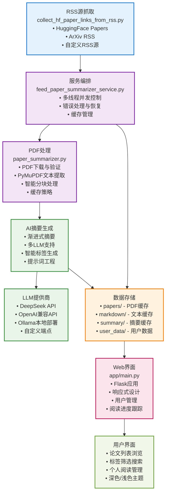

# 🤖 AI论文速览速学系统

> **让AI论文阅读变得简单高效，几分钟内掌握前沿技术要点**

`ai-paper-digest` 是一个专为AI研究者、工程师和学习者设计的智能论文摘要系统。它能够自动从RSS源获取最新AI论文，使用先进的AI模型（如DeepSeek、OpenAI兼容API、Ollama等）生成高质量的中文摘要，并提供现代化的Web界面帮助用户快速浏览和学习。

访问体验：[http://aipapers.wawuyu.cn/](http://aipapers.wawuyu.cn/)

## ✨ 核心特性

### 🚀 智能论文处理
- **自动RSS抓取**：支持HuggingFace、ArXiv等主流AI论文源
- **AI驱动摘要**：使用先进的AI模型生成结构化的中文论文摘要
- **多LLM支持**：支持DeepSeek、OpenAI兼容API、Ollama等多种LLM提供商
- **智能标签系统**：自动提取论文主题标签，支持多级分类
- **并行处理**：多线程并发处理，批量生成摘要效率高

### 🆕 最新更新 (v0.2.0+)
- **OpenAI兼容API支持**：新增对任何OpenAI兼容API的完整支持
- **DeepSeek API兼容性修复**：解决LangChain DeepSeek集成问题
- **多提供商无缝切换**：支持OpenAI、DeepSeek、Anthropic等主流API
- **增强的错误处理**：更友好的错误提示和故障排除指南

### 🌐 现代化Web界面
- **响应式设计**：支持桌面和移动设备
- **智能筛选**：基于标签和关键词的论文筛选
- **阅读进度跟踪**：记录已读论文，统计阅读数据
- **深色模式**：支持明暗主题切换
- **实时搜索**：快速定位感兴趣的论文

### 📚 结构化摘要内容
- **一句话总结**：快速理解论文核心贡献
- **创新点分析**：详细的技术创新点解析
- **实验结果**：关键指标和实际应用价值
- **术语表**：重要概念和缩写的解释

## 🏗️ 系统架构



## 📁 项目结构

```plaintext
ai-paper-digest/
├── collect_hf_paper_links_from_rss.py    # RSS源链接提取
├── feed_paper_summarizer_service.py      # 服务编排和流程控制
├── paper_summarizer.py                   # PDF下载、解析和AI摘要生成
├── summary_service/                      # 摘要服务包
│   ├── __init__.py                       # 包初始化
│   └── record_manager.py                 # 服务记录管理
├── app/                                  # Web应用目录
│   ├── __init__.py                       # Python包初始化
│   └── main.py                          # Flask Web应用主程序
├── run_app.py                           # 便捷启动脚本
├── summary_service/
│   └── prompts/                          # AI摘要提示词模板
├── summary/                              # 生成的论文摘要
├── papers/                               # 下载的PDF论文
├── markdown/                             # 提取的Markdown文本
└── ui/                                   # Web界面模板和样式
```

## 🚀 快速开始

### 环境要求
- Python 3.8+
- 现代浏览器（支持ES6+）

### 安装依赖
```bash
# 使用uv包管理器（推荐）
uv sync
```

### 管理员配置
要启用管理员功能（获取最新论文摘要），需要设置环境变量：

```bash
# 设置管理员用户ID（多个用户用逗号分隔）
export ADMIN_USER_IDS="admin,superuser"

# 或者在启动时设置
ADMIN_USER_IDS="admin" python app/main.py
```

管理员用户可以：
- 在Web界面看到"🔄 获取最新"按钮
- 点击按钮自动运行 `uv run python feed_paper_summarizer_service.py https://papers.takara.ai/api/feed`
- 获取最新的论文摘要并自动刷新页面

### 基础使用

#### 1. 从RSS源获取论文摘要（默认使用DeepSeek）
```bash
python feed_paper_summarizer_service.py https://papers.takara.ai/api/feed \
  --workers 4 \
  --output summaries.md \
  --api-key YOUR_AI_API_KEY
```

#### 2. 启动Web界面
```bash
# 方法1：使用便捷的启动脚本（推荐）
python run_app.py

# 方法2：直接运行主程序
python app/main.py

# 方法3：使用uv运行
uv run python app/main.py
```
访问 http://localhost:22581 即可使用Web界面

#### 3. 重建RSS源
```bash
python feed_paper_summarizer_service.py --rebuild \
  --output_rss_path hugging-face-ai-papers-rss.xml
```

#### 4. 仅生成标签（使用OpenAI兼容API）
```bash
python feed_paper_summarizer_service.py --tags-only \
  --provider openai \
  --base-url https://api.openai.com/v1 \
  --api-key YOUR_OPENAI_API_KEY \
  --model gpt-3.5-turbo
```

#### 5. 仅提取PDF文本（不进行LLM摘要）
```bash
python feed_paper_summarizer_service.py https://papers.takara.ai/api/feed \
  --extract-only \
  --workers 4
```

## 📖 使用指南

### 命令行参数
- `--provider`：LLM提供商选择（deepseek、ollama、openai）
- `--api-key`：API密钥
- `--base-url`：API基础URL
- `--model`：模型名称
- `--workers`：并行处理线程数（默认：CPU核心数）
- `--output`：汇总摘要输出文件
- `--output_rss_path`：RSS文件输出路径
- `--rebuild`：重建RSS文件
- `--local`：处理本地缓存的论文
- `--tags-only`：仅生成标签
- `--debug`：开启调试模式

### Web界面功能

#### 论文浏览
- **首页**：显示最新论文摘要，支持标签筛选
- **标签系统**：顶级分类（LLM、CV、NLP等）+ 细分标签
- **搜索功能**：基于标签的模糊搜索
- **分页浏览**：支持自定义每页显示数量

#### 个人管理
- **用户登录**：设置个人ID，跟踪阅读进度
- **已读列表**：查看已读论文，支持标签筛选
- **阅读统计**：显示总阅读量、今日阅读等数据
- **进度重置**：清空阅读记录重新开始

#### 论文详情
- **完整摘要**：结构化的论文总结内容
- **标签展示**：论文相关的主题标签
- **原始Markdown**：获取摘要的原始格式

## 🔧 技术实现

### 核心模块
- **`collect_hf_paper_links_from_rss.py`**：RSS源链接提取
- **`paper_summarizer.py`**：PDF下载、解析和AI摘要生成
- **`feed_paper_summarizer_service.py`**：服务编排和流程控制
- **`summary_service/`**：摘要服务包（解耦的服务记录管理）
- **`app/main.py`**：Flask Web应用

### 🏗️ 解耦架构设计

项目采用模块化设计，将摘要服务功能从Web应用中解耦：

- **`summary_service/`**：独立的摘要服务包
  - 提供摘要记录的创建、保存、加载功能
  - 支持新旧格式的兼容性
  - 可被多个模块复用（Web应用、后台服务等）
  - 不依赖Flask或其他Web框架

- **`app/main.py`**：专注于Web界面功能
  - 用户界面和交互逻辑
  - 路由处理和请求响应
  - 通过导入使用摘要服务功能

- **`feed_paper_summarizer_service.py`**：后台处理服务
  - RSS源处理和论文摘要生成
  - 使用解耦的摘要服务保存结果
  - 可独立运行，不依赖Web应用

### AI摘要流程
1. **PDF下载**：从论文页面解析并下载PDF文件
2. **文本提取**：使用PyMuPDF提取PDF文本内容
3. **智能分块**：按5000字符长度分块，支持重叠
4. **渐进摘要**：使用AI模型逐块生成摘要，最后整合
5. **标签生成**：基于摘要内容生成多级标签

### LLM提供商支持
- **DeepSeek**：默认提供商，支持DeepSeek-v3等模型
- **OpenAI兼容API**：支持任何兼容OpenAI接口的API服务
- **Ollama**：支持本地部署的Ollama服务
- **自定义配置**：可通过`--base-url`参数指定自定义API端点

#### 🔌 支持的LLM提供商详解

**1. DeepSeek (默认)**
- 使用 `--provider deepseek` 或默认
- 需要设置 `DEEPSEEK_API_KEY` 环境变量或 `--api-key` 参数
- 支持模型：deepseek-chat 等

**2. OpenAI兼容API (推荐)**
- 使用 `--provider openai`
- 支持任何兼容OpenAI接口的API服务
- 通过 `--base-url` 指定API端点
- 通过 `--model` 指定模型名称

**3. Ollama (本地部署)**
- 使用 `--provider ollama`
- 通过 `--base-url` 指定服务地址
- 通过 `--model` 指定模型名称
- 支持本地或远程Ollama服务

### 🎯 统一配置方式

系统采用统一的配置方式，根据 `--provider` 参数自动选择合适的默认值：

| 提供商 | 默认Base URL | 默认模型 | 说明 |
|--------|-------------|----------|------|
| `deepseek` | `https://api.deepseek.com/v1` | `deepseek-chat` | DeepSeek官方API |
| `openai` | `https://api.openai.com/v1` | `gpt-3.5-turbo` | OpenAI兼容API |
| `ollama` | `http://localhost:11434` | `qwen3:8b` | Ollama本地服务 |

**使用示例：**
```bash
# 使用默认配置(DeepSeek)
无需专门指定provider

# 自定义配置
--provider openai --base-url https://api.anthropic.com/v1 --model claude-3-sonnet-20240229

# 使用Ollama
--provider ollama --base-url http://127.0.0.1:11434 --model qwen3:8b
```

**支持的API服务包括：**
- **OpenAI官方API**：`--base-url https://api.openai.com/v1`
- **Anthropic Claude**：`--base-url https://api.anthropic.com/v1`
- **其他兼容服务**：任何遵循OpenAI接口规范的API


### 缓存策略
- **PDF缓存**：避免重复下载
- **Markdown缓存**：保存提取的文本
- **摘要缓存**：避免重复生成
- **标签缓存**：快速标签查询

## 🌟 应用场景

### 个人学习
- **快速了解**：几分钟内掌握论文要点
- **知识积累**：系统化学习AI前沿技术
- **研究方向**：发现感兴趣的研究领域

### 团队协作
- **技术分享**：生成易于理解的摘要
- **项目调研**：快速评估相关技术方案
- **知识管理**：建立团队技术知识库

### 学术研究
- **文献综述**：快速浏览大量相关论文
- **研究方向**：了解领域最新进展
- **论文写作**：参考相关工作的创新点

## 📊 性能特点

- **处理速度**：单篇论文摘要生成约2-5分钟
- **并发能力**：支持多线程并行处理
- **缓存效率**：避免重复计算，提升响应速度
- **内存优化**：分块处理大文档，控制内存使用

## 🔧 环境变量配置（若启动命令中未指定将使用环境变量）

```bash
# DeepSeek API
export DEEPSEEK_API_KEY="your-deepseek-api-key"

# OpenAI API
export OPENAI_API_KEY="your-openai-api-key"
export OPENAI_API_BASE="https://api.openai.com/v1"

# Ollama
export OLLAMA_BASE_URL="http://localhost:11434"
export OLLAMA_MODEL="qwen3:8b"
```

## 🤝 贡献指南

我们欢迎所有形式的贡献！无论是代码改进、文档完善，还是功能建议，都欢迎参与。

### 贡献方式
1. **Fork项目**：创建你的项目副本
2. **功能开发**：实现新功能或修复问题
3. **测试验证**：确保代码质量和功能正确性
4. **提交PR**：创建Pull Request

### 开发环境
```bash
# 克隆项目
git clone https://github.com/JY0284/ai-paper-digest.git
cd ai-paper-digest

# 安装开发依赖
uv sync

# 运行测试
python -m pytest tests/
```

## 📄 许可证

本项目采用MIT许可证，详见[LICENSE](LICENSE)文件。


## 📞 联系我们

- **GitHub Issues**：[报告问题](https://github.com/JY0284/ai-paper-digest/issues)

---

⭐ **如果这个项目对你有帮助，请给我们一个Star！** ⭐

> **让AI论文阅读不再是负担，而是知识的享受！**
